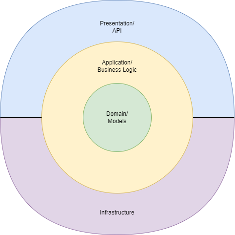

# Application

This document will describe how the minitwit application is structured and where different responsibilities lie.

In general is there used an onion architecture. as shown in Figure 1.

Fig.1 - Onion architecture

## Presentation / API

The presentation layer is responsible for accepting the incoming REST web requests and translate them
to method invocations to the application layer.

It is also this layer that today receives and sends JSON data and at some point in the future could 
be changed out for another data/presentation interface, like SOAP, CBOR, GraphQL, etc. 

In the project is this layer served in the [controllers](../../controllers) folder. 

## Application / Business logic

The responsibility of this layer is to serve an interface to the presentation layer, make calls to the domain
layer and make sure that the business logic and rules are kept / maintained for each call to the layer. 

In the project is this layer served in the [logic](../../logic) folder. 

## Domain / Models

Here are the models stored. These models are served through a repository pattern.

This project uses the ORM (Object–relational mapping) [GORM](https://gorm.io/index.html) to query the database.

In the project is this layer served in the [database](../../database) folder. 

## Other parts of the code

Further, are there other folders: 

- [log](../../log)
- [config](../../config)
- [functions](../../functions)
- [metrics](../../metrics)

which are helper packages that can be used more places than one specific package.