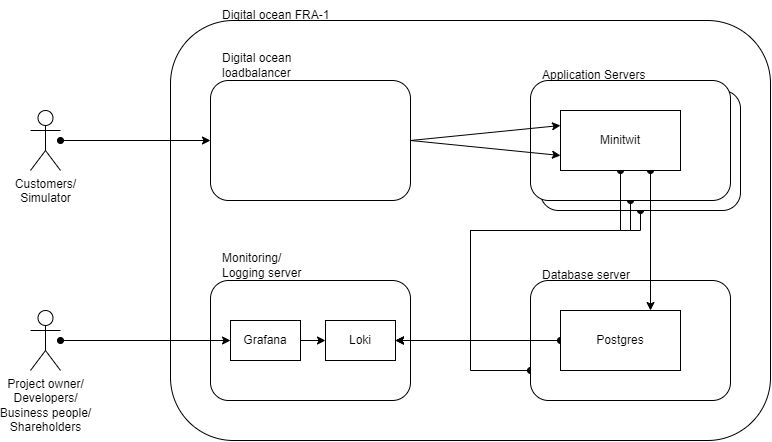

# Deployment

This document will describe how the services physically and conceptually deployed.

Actual provisioning and deployment scripts are located in the repository [Server Deployment](https://github.com/DevelOpsITU/ServerDeployment).

## System overview

The system is split up into a couple of groups.

- Application servers
- Database server
- Monitoring/Logging server
- Managed load-balancer

Here below in Figure 1 is an overview small overview of how the server instances are deployed and how the communication
flows in the system.

Fig.1 - Deployment overview

This is done to enable each of the "Responsibilities" to scale independently of each other.

### Application server

To scale the application server it could be scaled horizontally since they don't have state.
But the application is also primarily CPU intensive, and there for it could also be scaled vertically with more
CPU power but might not need that much more ram. 

### Database server

To scale the database server would it with the current design be the easiest to scale vertically with more RAM and DISC. 
And in the future could the database layer be redone or configured to scale horizontally. 

### Monitoring/Logging server

The two categories could have been split onto each of its own instances, and could have different requirements
for vertically and horizontal scaling. We decided to use the same server due to money constraints, and they could
run on the same instance for the duration of the course.

### Managed load-balancer

The Managed load-balancer is a service that [Digital ocean sells](https://www.digitalocean.com/products/load-balancer)
and they can currenty sells the service with

- 10.000 requests per second 
- 10.000 simultaneous connections 
- 250 SSL connections per second 

per instance ($10/month)