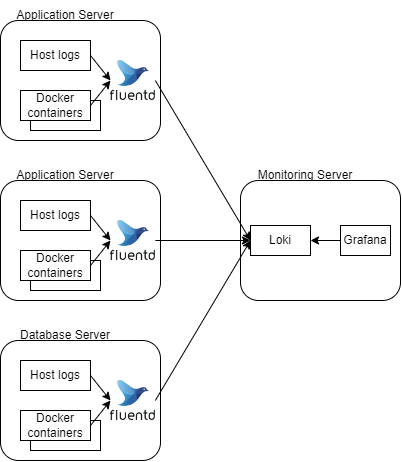
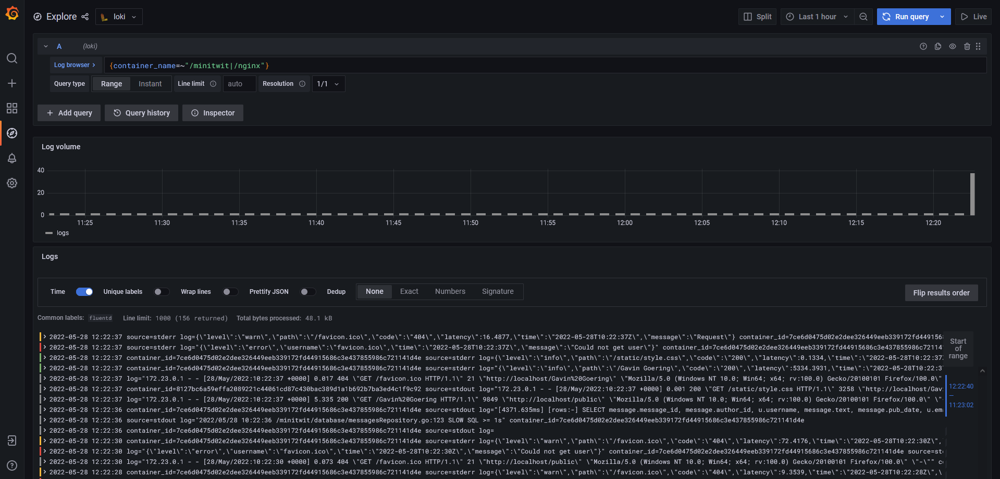

# Logging of the applications

This purpose of this document is to give a detailed description on how logging works in the system.

## Terminologies

### Log readers

Used to read or receive (optionally aggregate and buffer) logs

- [Filebeat](https://www.elastic.co/beats/filebeat)
- [Promtail](https://grafana.com/docs/loki/latest/clients/promtail/)
- [fluentd](https://www.fluentd.org/)
- [fluentbit](https://fluentbit.io/)
- [rsyslog](https://www.rsyslog.com/)

### Log management systems

Services/ applications that holds logs from multiple sources and enables the user to query the data.

- [Elastic search](https://www.elastic.co/)
- [Loki](https://grafana.com/oss/loki/)
- [Apache Lucene](https://lucene.apache.org/)
- [graylog](https://www.graylog.org/)

### Log visualizers

Services that can query and visualize logs and metrics.

- [Kibana](https://www.elastic.co/kibana/)
- [Grafana](https://grafana.com/)
- [splunk](https://www.splunk.com/)
- [graylog](https://www.graylog.org/)

## Design options

In general there are two major stacks of dealing with logs. Elastic search and Loki. 
The main difference between the two is that Elastic search indexes most of the data that enters the engine. 
Where Loki only indexes on a limited options and leaves post-processing to the client.

This also means that Elastic search is a heavier applicaiton to run on the server and requires more disk space.
Where Loki takes less space for the index file [^1]. 

[^1]: https://crashlaker.medium.com/which-logging-solution-4b96ad3e8d21

Since the monitoring/logging applications is run on the same compute instance with 1gb ram did the instance not have 
enough memory to run the ELK stack, unless we upgraded the instance.

Further more did the group also want to try and work with the Loki stack / integration in Grafana. 

And with the fluentd application as log collector and forwarder could we in the future 
add a sink that sends data to an elastic search instance.

## Chosen implementation

The image below show how the logging flows in to the log management services.

On each server are there a fluentd service running that either reads docker logs or tails files on the host system. 
Then forwards the logs to Loki, which then can be queried either directly with a CLI or through the Grafana interface. 

Fig.1 - Log flow

There could have been added a fluentd service in between the other fluentd services and Loki, which could receive
data from all the services and forward it to Loki and in the future maybe Elastic search. Then all the logs would be in
a uniformed data structure that fluentd knows and could filter some services to Loki, and other to 
Elastic search or a mix. 

The outcome of the design and setup is that Loki can be queried from Grafana and all logs form all services or hosts 
is collected in one place and can be queried.

Fig.2 - Grafana dashboard for querying loki

