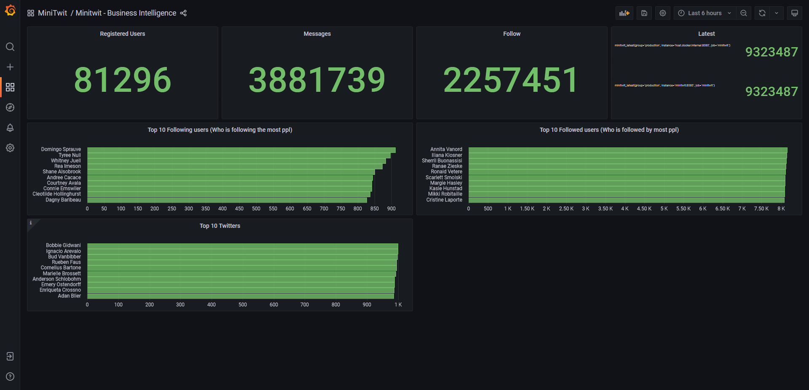
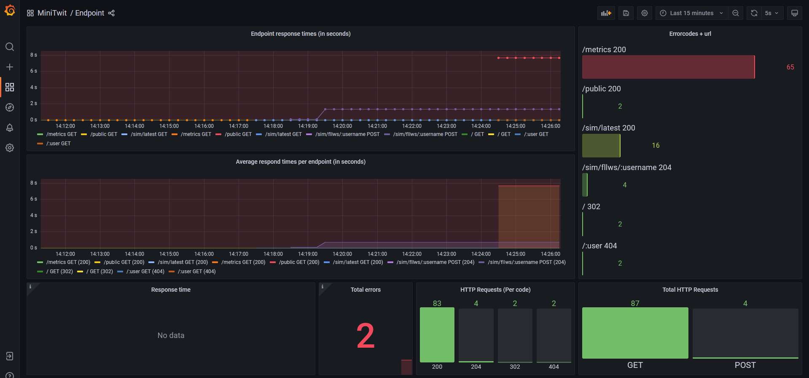
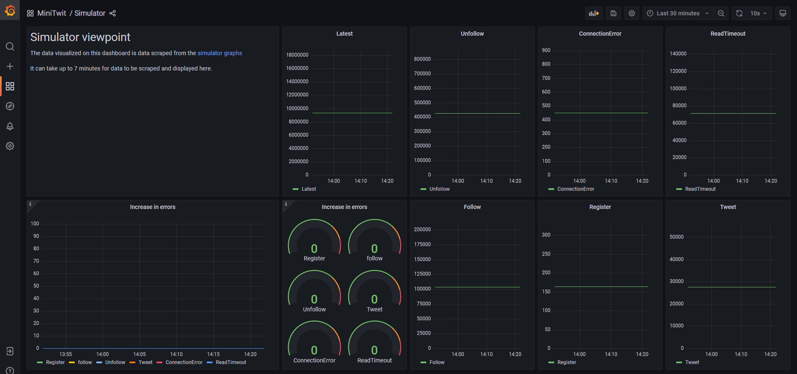

# Monitoring

In order to keep an eye on the state and response of the application have there been added monitoring.

//TODO: Add image of how Prometheus work.

And from the dataflow and the provisioing files to grafana have we created the following dashboards.
Which tracks different parts of the system. 

## Business intelligence 

This dashboard shows:
- How many users are registered to the platform
- How many messages have been posted
- Who follows the most people
- Who are followed by the most people
- Who have posted the most messages.
- What request id are the latest from the simulator

Fig.1 - Business intelligence dashboard

## Endpoints

This dashboard shows:

- Different endpoints and their response times
- How summery of different response codes and distributions.

Fig.2 - Endpoint dashboard (The image, is not so good since it was taken after the services was stopped)

## Simulator

This dashboard shows:

- Errors that the simulator sees.

It does this by polling the metrics from the application [Data Scraper](https://github.com/DevelOpsITU/DataScraper) 
which scrape the data from the [simulator](http://164.92.246.227/status.html)

Fig.3 - Simulator dashboard

