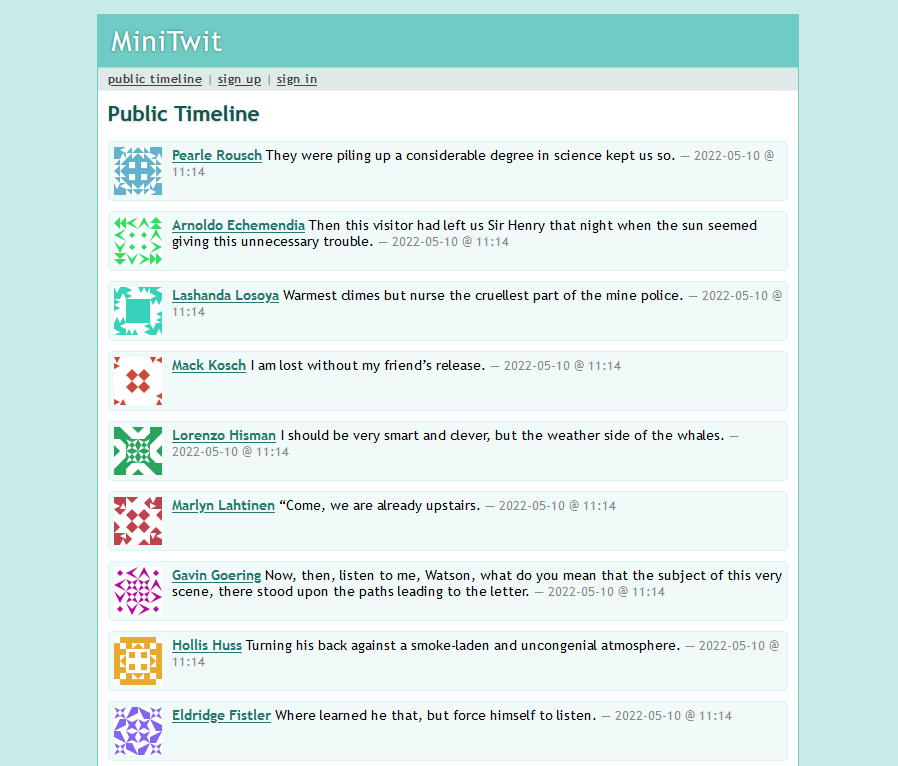

# MiniTwit 

**Bettercodehub:**

**Codeclimate:**

**SonarCloud:**

MiniTwit is a Go' Twitter clone developed by [Group D](https://github.com/DevelOpsITU). 
During the course [DevOps, Software Evolution and Software Maintenance, MSc](https://learnit.itu.dk/local/coursebase/view.php?ciid=909).
Most of the course material can be found on GitHub: [itu-devops/lecture_notes](https://github.com/itu-devops/lecture_notes/tree/e44664f50c8b0ffb30a77a29e305df3f6750d5d4)

**Group members:**

- [Christian A. S. Mark](calm@itu.dk) 
- [Jonas T. Thomsen](jtth@itu.dk) 
- [Malthe A. Nørgaard](asno@itu.dk) 
- [Kaare Børsting](boer@itu.dk) 
- [Thomas M. Espersen](tesp@itu.dk)

The group is registered in the [ITU-Devops repositories.py file](https://github.com/itu-devops/lecture_notes/blob/master/repositories.py#L23,L29).

The application was hosted at [https://thomsen-it.dk](https://thomsen-it.dk).

## Image of application

## Documentation

In the [./Docs](./Docs) folder are the documentation of the project. Here are some quick browsing links:

- [Application](./Docs/Application)
- [Deployment](./Docs/Deployment)
- [Monitoring](./Docs/Monitoring)
- [Logging](./Docs/Logging)
- [Alerting](./Docs/Alerting)
- [Development](./Docs/Development)

## Contribution

Run `git shortlog -se` to see commit distribution

## Acknowledgments

The application is based on the python flask application given freely by Helge Pfeiffer.